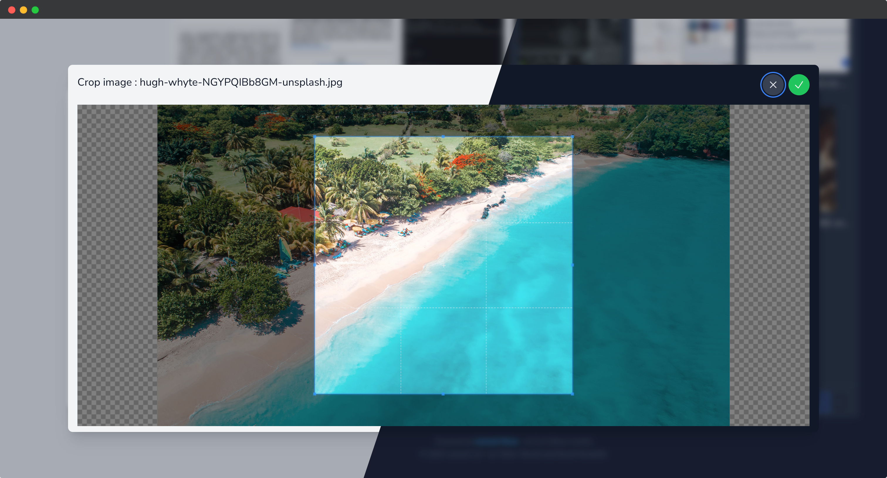

# Cropper

<br>

<br>

The package provides a crop feature. It uses the [Copper.js](https://github.com/fengyuanchen/cropperjs) library under the hood.

## Passing options to field/tool

You may provide Cropper.js-specific options to the tool or a resource field :

```php{15-17}
// app/Nova/Project.php

use Oneduo\NovaFileManager\FileManager;
use Oneduo\NovaFileManager\Rules\FileLimit;

class Project extends Resource
{
    // ...

    public function fields(NovaRequest $request): array
    {
        return [
            // ...
            FileManager::make(__('Attachments'), 'attachments')
                ->cropperOptions([
                    'aspectRation' => 16 / 9,
                ]),
        ];
    }
}

```

The complete list of available options can be found at https://github.com/fengyuanchen/cropperjs/blob/main/README.md#options
