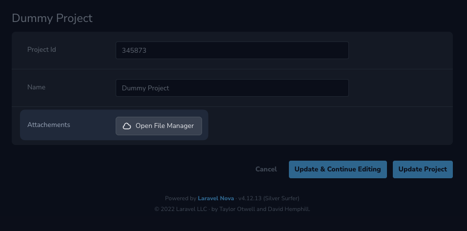

# Using the field

## Using the field on a Nova Resource

You can start using the field by adding a `FileManager` field to your Nova resource :

```php
// app/Nova/Project.php

use Oneduo\NovaFileManager\FileManager;

class Project extends Resource
{
    // ...

    public function fields(NovaRequest $request): array
    {
        return [
            // ... any other fields
            FileManager::make(__('Attachments'), 'attachments'),
        ];
    }
}
```

🎉 You have now successfully added a File Manager field to your resource.



## Multiple selection on the form field

When using the `FileManager` field on your Nova resource, you can tell the tool to allow multiple selection for your
attribute.

By default, the tool will only allow single selection.

You can allow multiple selection by using the `multiple` method to the field. You may limit the number of selected field
by using the `limit` method.

```php
// app/Nova/Project.php

use Oneduo\NovaFileManager\FileManager;

class Project extends Resource
{
    // ...

    public function fields(NovaRequest $request): array
    {
        return [
            // ... any other fields
            FileManager::make(__('Attachments'), 'attachments')
                ->multiple()
                ->limit(10),
        ];
    }
}
```


## Validation

When using the field, you can specify the number of files that can be set a value for your resource's attribute.

For that, you can specifically use the following custom rule :

```php
// app/Nova/Project.php

use Oneduo\NovaFileManager\FileManager;
use Oneduo\NovaFileManager\Rules\FileLimit;

class Project extends Resource
{
    // ...

    public function fields(NovaRequest $request): array
    {
        return [
            // ... any other fields
            FileManager::make(__('Attachments'), 'attachments')
                ->rules(new FileLimit(min: 3, max: 10))
                ->multiple()
                ->limit(10),
        ];
    }
}
```
::: tip NOTE
You need to set up your field with `multiple` if you plan on having a minimum value greater than one, and if
you expect your field to have more than one file.
:::

## Registering a custom URL resolver for your fields

When using a multi-disk setup, the disk is saved alongside the path of your asset, however, if these two files come from
different filesystems, you may want to generate an URL with your own custom business logic.

For instance, having a `User` resource, to which you have references for `pictures` and the selection was as follows :

- my-picture.jpg (from the `public` disk)
- avatar.png (from the `s3`disk)

You may then use the `resolveUrlUsing` method to customize how the file URL is generated.

```php
// app/Nova/User.php

use Oneduo\NovaFileManager\FileManager;
use Oneduo\NovaFileManager\Rules\FileLimit;

class User extends Resource
{
    // ...

    public function fields(NovaRequest $request): array
    {
        return [
            // ... any other fields
            FileManager::make(__('Pictures'), 'pictures')
                ->resolveUrlUsing(function (NovaRequest $request, string $path, string $disk, Filesystem $filesystem) {
                    if ($disk === 's3') {
                        return $filesystem->temporaryUrl($path, now()->addMinutes(5));
                    }

                    return $filesystem->url($path);
                })
                ->limit(3),
        ];
    }
}
```
