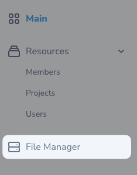

# Using the tool

## Register the service provider

To start using the tool, you will need to register the tool in your `NovaServiceProvider.php` file :

```php
// NovaServiceProvider.php

use BBSLab\NovaFileManager\NovaFileManager;

class NovaServiceProvider extends NovaApplicationServiceProvider
{
    // ...

    public function tools(): array
    {
        return [
            // ... any other tools
            NovaFileManager::make(),
        ];
    }
}
```

Now that the tool is registered, if you go back to your Nova dashboard, you should see a new navigation entry labeled "
File Manager".



## Adding a new menu entry to a custom navigation

If you are using a custom menu, you may want to add a new entry to it.

```php
MenuSection::make('File Manager')->path('/nova-file-manager')
```

## Navigating in the tool


| Marker | Description                  |
|--------|------------------------------|
| 1      | Disk switcher dropdown       |
| 2      |  Pagination control dropdown |
| 3      |  View mode toggle            |
| 4      |  Global search bar           |
| 5      |  New folder button           |
| 6      |  Upload file button          |
| 7      |  Breadcrumbs                 |
| 8      |  Folders list                |
| 9      |  Files list                  |
| 10     |  Pagination controls         |

## Dark mode support

The tool fully supports dark mode, it automatically syncs to your Laravel Nova color scheme settings.

