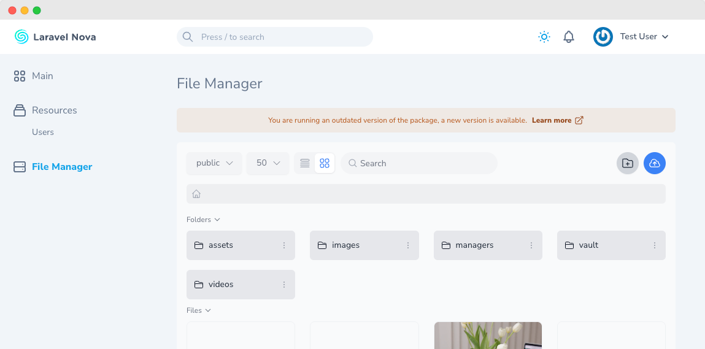

# Update checker

The package provides an automatic update checker that will eventually notify you through a subtle banner that a new update is avaiable.

This feature can be disabled, it is enabled by default, and it will check the latest available release with a 1 hour cache.

Once a new release is available, you can update the package and then run 
`php artisan cache:clear` to clear your cache and dismiss the banner. Otherwise it will dismiss automatically after 1 day.
